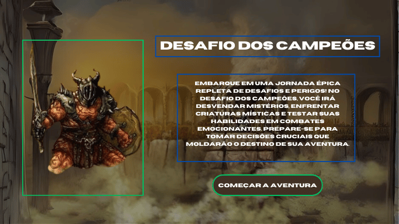
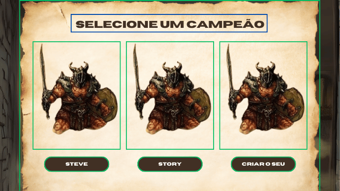
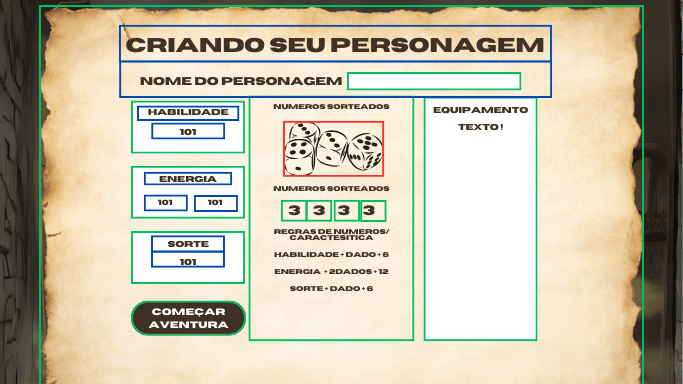
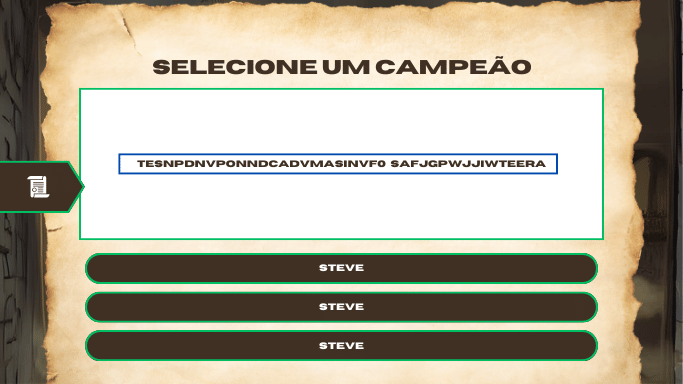
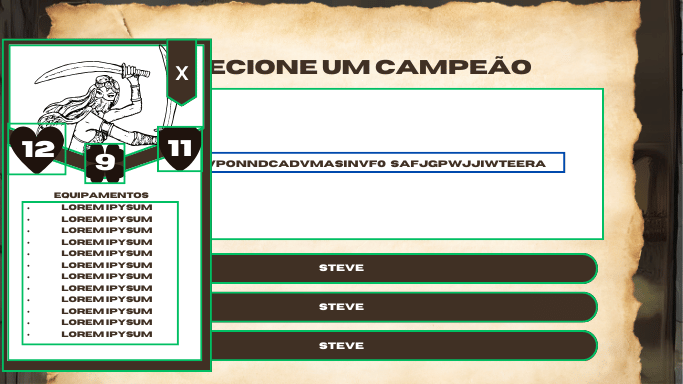
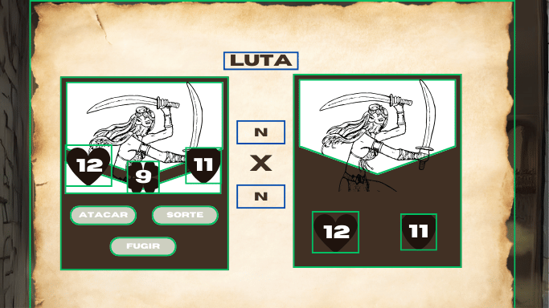

# Read.me

# Jogo de Aventura Interativa — “Desafio dos Campeões”

## 1. Introdução do Projeto

Este jogo foi desenvolvido durante a Imersão Alura com o Gemini. Inspirado nos clássicos livros “Escolha Sua Própria Aventura”, o projeto foca em uma experiência de jogo interativa, com tomadas de decisão, batalhas e desenvolvimento de personagens, utilizando HTML, CSS e JavaScript.

## 2. Minha Jornada no Desafio da Imersão Alura

Participar dessa imersão foi uma verdadeira montanha-russa de emoções e aprendizados. Embora eu já tivesse uma boa noção de lógica de programação, me aprofundar em JavaScript puro foi uma experiência desafiadora e transformadora. Confesso que foi a primeira vez que me envolvi tão profundamente com a linguagem e tive que sair da minha zona de conforto diversas vezes.

Um aspecto crucial do meu aprendizado foi a parceria com a IA da **Gemini**, que foi uma verdadeira aliada ao longo do processo. A IA me ajudou a resolver diversos problemas complexos e me tirou de alguns sufocos quando fiquei travado. Sem ela, muitos desafios teriam sido mais difíceis de superar, especialmente no que diz respeito à lógica do jogo e à implementação de funcionalidades críticas. Ela foi uma verdadeira parceira de aprendizado e acelerou minha evolução como desenvolvedor!

Aqui está um resumo dos principais marcos e desafios que enfrentei:

- **Dia 1: Estrutura Inicial do Jogo**
    
    Esse foi um começo tranquilo. Organizar a estrutura HTML e CSS foi relativamente fácil para mim, uma vez que já tinha uma boa noção dessas tecnologias. O foco criou as bases do jogo, onde as histórias e decisões começariam a se formar.
    
- **Dia 2: Desenvolvimento de Lógica com JavaScript**
    
    Foi aqui que as coisas começaram a esquentar. Implementar a lógica das decisões com JavaScript e manipular o DOM para refletir as escolhas do jogador me tirou algumas horas de sono (e talvez algumas saídas de final de semana com minha namorada! 😅). Eu já entendia a lógica de programação, mas foi a primeira vez que apliquei JavaScript puro de forma tão extensa. Durante esse processo, a IA da Gemini foi uma ferramenta essencial, me guiando nos momentos em que parecia que as coisas não iam funcionar e oferecendo soluções práticas. Isso fez uma enorme diferença no meu progresso.
    
- **Dia 3: Implementação do Sistema de Combate**
    
    Nesse ponto, já me sentia mais confortável com o JavaScript, mas implementar o sistema de combate com atributos como habilidade, energia e sorte foi um grande desafio técnico. Felizmente, a IA da Gemini estava lá para me ajudar a refinar a lógica de batalha, especialmente nos momentos em que o código parecia travado em bugs. Mais uma vez, sacrifiquei um tempo de lazer com minha namorada, o que gerou algumas discussões engraçadas sobre o tempo dedicado ao projeto! 😄
    
- **Dia 4: Otimização e Salvamento de Progresso**
    
    Finalmente, consegui integrar o sistema de salvamento de progresso com o localStorage. Foi gratificante ver o jogo se tornando mais completo e com uma funcionalidade que realmente melhorava a experiência do usuário. Durante essa fase, a IA me ajudou a garantir que a funcionalidade de salvamento fosse implementada corretamente, evitando perda de dados do jogador.
    
- **Dia 5: Testes e Debugging**
    
    Aqui percebi a verdadeira complexidade de criar um jogo interativo. Realizar testes para garantir que todas as escolhas e ações do jogador refletissem corretamente na história e nas batalhas foi um processo meticuloso. Foi preciso paciência e persistência para depurar os erros, mas cada erro corrigido me fazia sentir um passo mais próximo de finalizar um projeto do qual eu pudesse me orgulhar. A IA também foi fundamental para apontar possíveis falhas e melhorar a eficiência do código.
    

Essa jornada foi muito mais do que um desafio técnico. Aprendi não apenas a dominar mais o JavaScript, mas também a importância do equilíbrio entre trabalho, lazer e relacionamento. No final, todos os sacrifícios valeram a pena, e estou muito satisfeito com o resultado.

## 3. Wireframes e Processo de Design.

Utilizei wireframes para planejar a interface e garantir uma boa experiência de usuário. Abaixo estão os principais wireframes que guiaram o desenvolvimento:

### 3.1 Wireframes

- **Seleção de Campeão**: Interface para escolher entre campeões predefinidos ou criar um personagem personalizado.
- **Página de História**: Local onde as narrativas e decisões do jogador ocorrem, com barra lateral exibindo a condição do personagem.
- **Tela de Batalha**: Exibição de atributos do jogador e opções de combate (ataque, sorte, fuga, etc.).













### 3.2 Diagrama de Fluxo do Jogo

Para estruturar a lógica de decisões e combates, criei um diagrama de fluxo que mapeia o percurso do jogador, desde a criação do personagem até os múltiplos finais possíveis.

### Fluxo de Progresso do Jogo (Salvamento e Recuperação de Estado)

.png)

**Objetivo**:

Esse diagrama mostra como o progresso do jogador é salvo e recuperado ao longo do jogo. Ele detalha como o `localStorage` é utilizado para armazenar o estado atual do jogo (incluindo atributos do jogador, estado das batalhas, e progresso da história), e como esses dados são recuperados quando o jogador retorna ao jogo.

**Por que incluir**:

Incluí esse diagrama porque ele explica uma das funcionalidades mais importantes do projeto: a capacidade de o jogador sair e voltar ao jogo sem perder o progresso. O diagrama facilita entender como o sistema de salvamento funciona, o que é essencial para garantir que o jogo continue de onde parou. Além disso, desenvolvedores podem utilizá-lo para identificar rapidamente como a lógica de salvamento foi implementada, facilitando a manutenção e possíveis melhorias nessa área.

### Diagrama de Arquitetura do Código.

.png)

**Objetivo**:

Esse diagrama ilustra a estrutura do projeto, mostrando como os diferentes arquivos (HTML, CSS, JavaScript) interagem entre si para criar a experiência de jogo. Ele ajuda a visualizar como os dados são manipulados, como a lógica do jogo é gerenciada, e como a interface de usuário foi montada.

**Por que incluir**:

Incluí esse diagrama para fornecer uma visão clara da organização do código. Isso é útil para qualquer desenvolvedor que queira entender rapidamente a estrutura do projeto. Além disso, a arquitetura modular facilita futuras expansões e contribuições ao projeto, e o diagrama oferece uma visão abrangente de como cada parte do código se conecta e colabora para fazer o jogo funcionar.

### Fluxo do Sistema de Batalha

.png)

**Objetivo**:

Este diagrama permite explicar como as batalhas acontecem no jogo. Ele detalha como os atributos do jogador, como **habilidade**, **energia** e **sorte**, são usados durante o combate, além de mostrar como a criatura adversária também utiliza seus atributos para determinar o vencedor de cada rodada. O fluxo segue desde o início da batalha até o cálculo de dano e o resultado (vitória ou derrota).

**Por que incluir**:

Decidi incluir esse diagrama porque ele facilita a compreensão da mecânica de combate, tanto para os jogadores quanto para os desenvolvedores que pretendem contribuir com o projeto. Com ele, é possível entender rapidamente como o sistema de batalha foi projetado, facilitando ajustar, testar e expandir essa parte do código. Além disso, ele também destaca como os atributos e as rolagens de dados influenciam diretamente o resultado das batalhas.

### Fluxo de Decisão do Jogo

.png)

**Objetivo**:

Esse diagrama visa mostrar claramente como o jogador toma decisões ao longo do jogo, e como cada escolha afeta o caminho que ele segue na aventura. Desde a escolha inicial do campeão até as decisões na história, cada ação tomada pelo jogador pode levá-lo a diferentes ramificações e desfechos.

**Por que incluir**:

Achei importante incluir esse diagrama porque ele ajuda a visualizar a lógica ramificada do jogo. Isso facilita para que os desenvolvedores e colaboradores compreendam como as decisões do jogador influenciam a progressão da história. Além disso, ajuda a destacar a estrutura modular da narrativa, permitindo que novas histórias sejam integradas facilmente ao sistema.

## 4. Principais Funcionalidades do Jogo

- **Tomada de Decisões**: Cada escolha altera o rumo da história.
- **Sistema de Combate**: Atributos como habilidade e sorte influenciam o resultado das batalhas.
- **Criação de Personagem**: Personalize seu herói.
- **Progresso Salvo**: Continue sua aventura com o salvamento automático.

## 5. Tecnologias Utilizadas

- **HTML5**: estrutura do jogo.
- **CSS3**: estilização e layout.
- **JavaScript (ES6+)**: Controle da lógica do jogo.
- **Local Storage**: Salvamento do progresso.

## 6. Instruções para Instalação e Uso.

Para rodar o jogo localmente:

```bash
bash
Copiar código
git clone https://github.com/Cerutti202/DesafioDosCampeos
cd desafio-dos-campeoes

```

Abra o arquivo `index.html` em seu navegador para iniciar o jogo.

## 7. Como Jogar

- Escolha ou crie um personagem.
- Faça escolhas que definirão o destino do seu personagem.
- Enfrente criaturas em batalhas estratégicas.
- Explore histórias até completar a aventura.

## 8. Próximos Passos e Atualizações Futuras.

- **Efeitos Sonoros e Música**: Sons de batalha e música de fundo.
- **Gráficos e Animações**: Melhorias visuais nas batalhas.
- **Modo Multiplayer**: Enfrente ou colabore com outros jogadores online.
- **Expansão de Histórias**: Novos capítulos e desafios.

## 9. Agradecimentos

Agradeço à Alura e ao Gemini pela oportunidade de aprendizado. Este projeto reflete meu desenvolvimento como programador e minha paixão por criar experiências interativas. Também deixo um agradecimento especial à IA da Gemini, que foi uma verdadeira parceira de aprendizado, e à minha namorada por sua paciência durante todo o processo! ❤️

## 10. Contatos

- **LinkedIn**: [Seu LinkedIn](https://www.linkedin.com/in/kaiocerutti/)
- **GitHub**: [Seu GitHub](https://github.com/Cerutti202)